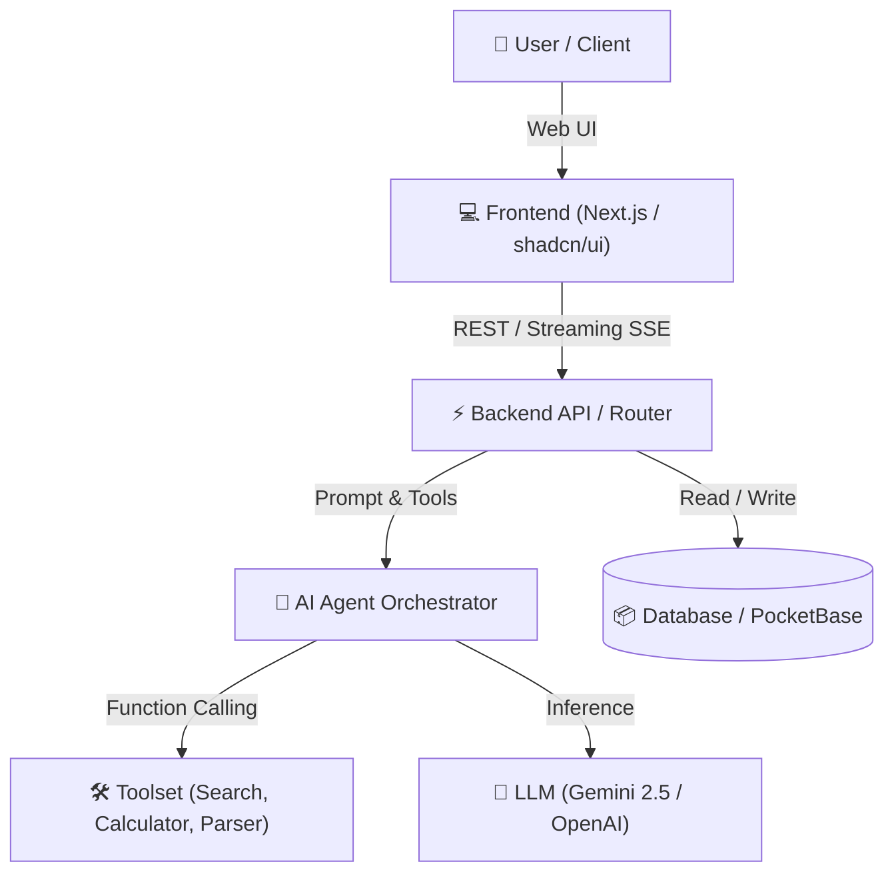

# 🚀 Project Name | HackAlem AI 2026

> **Team:** Anhalt Students  
> **Repository:** `BAITC-Hacks/hack-98e048a9-anhalt-students`  
> **Track:** [Specify Track Name at 13:00, e.g., AI Agent / Assistant]  
> **Live Demo / Presentation:** [Link to demo / slides if applicable]

---

## 📌 1. Overview & Solution Value (Ценность решения)

### Problem Statement
Describe the core pain point and real-world problem being solved. What friction exists in the current workflow?

### Our Solution
A concise explanation of the developed technology. How does this solution leverage AI to deliver clear, measurable value to target users?

* **Key Benefit 1:** Fast, automated processing.
* **Key Benefit 2:** Multi-modal / multi-agent reasoning.
* **Key Benefit 3:** Seamless, accessible user experience.

---

## 🏗️ 2. System Architecture (Архитектура решения)

The solution is designed with a modular, scalable architecture separating the presentation layer, business logic / agent orchestration, and persistence.



---

## 💻 3. Technology Stack (Используемые технологии)

* **Frontend:** Next.js 14/15, TypeScript, Tailwind CSS, `shadcn/ui`, Lucide Icons
* **Backend:** Python 3.11+ / FastAPI (or Next.js Server Actions)
* **AI & Agent Orchestration:** Google GenAI SDK / OpenAI Agents / LangGraph
* **Database & Auth:** PocketBase / SQLite
* **DevOps & Verification:** Automated Pytest / Vitest, Docker

---

## ⚙️ 4. Environment Variables (Параметры окружения)

Create a `.env` file in the root directory by copying from `.env.example`:

```bash
cp .env.example .env
```

| Variable | Description | Required | Default / Mock Value |
|---|---|---|---|
| `PORT` | Local application port | Optional | `3000` |
| `OPENAI_API_KEY` | OpenAI API key for agent inference | Optional* | *Fallback to mock if empty* |
| `GEMINI_API_KEY` | Google Gemini API key | Optional* | *Fallback to mock if empty* |
| `DEMO_MOCK_MODE` | Enable offline mock data for testing | Optional | `true` |

> [!NOTE]  
> **Rule 5.6.6 Compliance:** Reviewers and technical experts can run this solution **without** needing a personal paid API key; simply leave `DEMO_MOCK_MODE=true` to test the full end-to-end user scenario with pre-recorded demo data.

---

## 🚀 5. Installation & Quick Start (Инструкция по установке и запуску)

> **Requirement (Rule 5.4.15 & 5.6.5):** The project must build and run locally in standard environments.

### Option A: Standard Run (Node.js & Python)

1. **Clone the repository:**
   ```bash
   git clone https://github.com/BAITC-Hacks/hack-98e048a9-anhalt-students.git
   cd hack-98e048a9-anhalt-students
   ```

2. **Install dependencies:**
   ```bash
   # Frontend
   npm install

   # Backend (if running Python backend)
   pip install -r requirements.txt
   ```

3. **Start the application:**
   ```bash
   npm run dev
   ```
   Open your browser at `http://localhost:3000`.

---

## 🧪 6. Verification & Test Scenario (Порядок проверки решения)

To verify the core scenario as required by technical evaluation:

1. Open `http://localhost:3000` in your browser.
2. Navigate to the main demo interface.
3. Submit a sample query:
   > *"Analyze the quarterly report and extract top 3 risks"*
4. Observe:
   - The AI Agent plans the task and displays tool invocation status.
   - The final structured result and chart/summary render on screen.
5. **Automated Tests:**
   ```bash
   npm test
   # or
   pytest
   ```

---

## 📦 7. Third-Party & Open-Source Components (Раскрытие сторонних материалов)

> In strict compliance with **Rules 5.4.4, 5.4.4.1, and 5.4.6**, all third-party libraries, templates, and frameworks used in this project are explicitly disclosed below:

* **[shadcn/ui](https://ui.shadcn.com/)** (MIT License) — Accessible UI component primitives.
* **[Tailwind CSS](https://tailwindcss.com/)** (MIT License) — Utility-first CSS styling.
* **[Lucide Icons](https://lucide.dev/)** (ISC License) — Iconography set.
* For the full list of reference resources and boilerplates, see [docs/STARTER_RESOURCES.md](docs/STARTER_RESOURCES.md).
