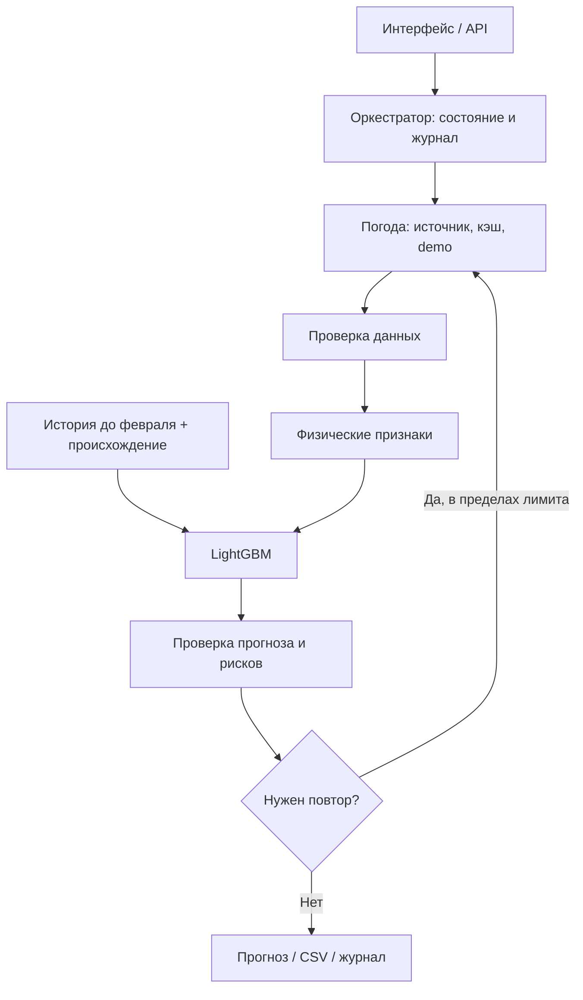

# Samruk WindAgent AI

HackAlem AI 2026 · кейс «Agentic AI для прогнозирования выработки ВЭС» · команда **Anhalt Students**.

Прототип прогноза на 24–48 часов с физическими признаками, LightGBM, предупреждениями RU/KZ и журналом работы агента. Демонстрация запускается без API-ключей. Точность на реальной выработке февраля 2026 **не подтверждена**.

Ниже — 11 пунктов [инструкции организатора](task_data/file5). Проверка требований и оставшиеся риски: [аудит подачи](docs/SUBMISSION_AUDIT.md).

## 1. Название проекта

**Samruk WindAgent AI** — прогнозирование почасовой выработки ВЭС и поддержка диспетчерского планирования.

- Турбина №1: `43.645150, 78.535604`; мощность в конфигурации — 2,5 МВт.
- Турбина №2: `43.643198, 78.538828`; мощность в конфигурации — 2,5 МВт.
- `farm` — сумма отдельных прогнозов обеих турбин, 5,0 МВт. Паспортные параметры требуют подтверждения оператором.

Название команды и репозиторий взяты из материалов проекта и `git remote`. Состав команды и факт сдачи на платформе локальным кодом не подтверждаются.

## 2. Краткое описание — какую проблему решает проект и для кого.

Диспетчеру ВЭС нужен почасовой план генерации с учётом изменения погоды. Проект собирает входы по координатам, рассчитывает выработку, отмечает сильный ветер, холод и скачки мощности, затем пересчитывает результат при обновлении данных.

Практическая ценность — воспроизводимый путь от погоды до плана и объяснения ограничений. Снижение небалансов потребует проверки по фактической выработке. Подтверждённых расчётов экономии или действующего тарифа KEGOC в проекте нет.

## 3. Что реализовано — основные функции и возможности решения.

- Прогноз по дате, горизонту и турбине; основной сценарий — 24 или 48 часов.
- Open-Meteo Historical Forecast API, кэш и детерминированный демонстрационный режим с раскрытием источника данных.
- Плотность воздуха `ρ = P / (287,058 × T)`, куб скорости ветра, приближённая кривая мощности, перенос скорости с 10 на 100 м при отсутствии высотного ветра.
- LightGBM с физическими и временными признаками, нормированной мощностью `[0, 1]` и нулевым прогнозом при штормовом пороге 25 м/с.
- Сравнение ML-прогноза с физической кривой. Persistence и Skill Score не вычисляются без подтверждённых наблюдений; сравнение двух моделей не является оценкой точности.
- Цикл агента с проверкой входов и результата, условным повторным получением данных, реакцией на изменение входов и журналом решений.
- Правила диспетчерского анализа и пояснения RU/KZ; веб-интерфейс, JSON API и CSV.
- Динамическая загрузка исторических SCADA-данных (`POST /api/upload/scada` и кнопка в веб-интерфейсе): транзакционная валидация схемы колонок и диапазонов `[0, 1]`, тестовое обучение на кандидате перед изменением состояния/диска, потокобезопасное переобучение моделей турбин с честным присвоением статуса `USER_SUPPLIED_UNVERIFIED` (или `SYNTHETIC_DEMO` при совпадении хэша).
- Интерактивный плеер тестового периода (1–28 февраля 2026): пошаговое воспроизведение 28 последовательных суточных прогнозов с анимацией, ползунком дней (1..28), регулировкой скорости (1x, 2x, 4x) и оперативным отображением профиля мощности и предупреждений диспетчера.
- Последовательная выгрузка февраля для обеих турбин.

Включённый демонстрационный набор обучения не заменяет историю работы ВЭС, предоставленную организатором.

## 4. Как работает решение — кратко опиши основной пользовательский сценарий от входных данных до результата.

1. Запустите сервер по разделу 7 и откройте `http://localhost:8000`.
2. Выберите `2026-02-14`, `48` часов и первую турбину.
3. Агент получает погоду, проверяет значения и часовую сетку, формирует физические признаки и вызывает модель.
4. При некорректной погоде агент повторяет получение один раз; при ошибке модели использует физическую кривую. Ограничения мощности применяются до повторного аудита. SHA-256 входов, номер ревизии и решения сохраняются в журнале.
5. Изучите выработку, КУИМ, предупреждения, источник входов и журнал решений. Скачайте CSV.
6. Запрос с `refresh_weather=true` повторно получает входы и позволяет проверить решение о пересчёте.

Время — местное `Asia/Almaty` (UTC+05:00 в тестовом периоде). Один интервал равен часу: `predicted_mwh = predicted_power × rated_capacity_mw × 1 час`. Приложение не управляет турбинами и не отправляет заявки диспетчеру.

## 5. Технологии — языки, фреймворки, библиотеки, AI-модели, API и внешние сервисы.

- Python 3.11+, FastAPI, Uvicorn, Pydantic, python-multipart — сервер, загрузка файлов и проверка запросов.
- LightGBM, scikit-learn, NumPy, pandas, joblib — обучение, прогноз и расчёты.
- Requests, python-dotenv — погодный клиент и необязательные настройки.
- HTML, JavaScript, Tailwind CSS, Chart.js, Lucide — интерфейс. Стили и графическая библиотека загружаются с CDN; при их недоступности остаются базовое оформление и почасовая таблица.
- Pytest, HTTPX / FastAPI TestClient — автоматическая проверка.
- Open-Meteo Historical Forecast API — погодный источник.
- `uv`, [pyproject.toml](pyproject.toml), [uv.lock](uv.lock) — воспроизводимое окружение.

Агент — программная машина решений с инструментами. LLM-вызовов, LangGraph, CrewAI или нескольких независимых AI-агентов в приложении нет. AI-инструменты разработки не являются частью исполняемой модели. [STARTER_RESOURCES.md](docs/STARTER_RESOURCES.md) — каталог справочных ссылок, а не список внедрённых компонентов.

## 6. Архитектура проекта — основные компоненты и как они взаимодействуют.



- [weather_tool.py](backend/agent/weather_tool.py) — получение погоды, единицы и происхождение.
- [data_loader.py](backend/agent/data_loader.py) — история обучения и проверка данных.
- [physics.py](backend/agent/physics.py) — плотность, высотный ветер и кривая мощности.
- [model.py](backend/agent/model.py) — обучение, временная валидация и прогноз.
- [pipeline.py](backend/agent/pipeline.py) — агентный цикл, проверка изменений, журнал и месячный расчёт.
- [reasoner.py](backend/agent/reasoner.py) — правила рисков и двуязычные пояснения.
- [main.py](backend/main.py) — API и интерфейс.
- [run_february_test.py](scripts/run_february_test.py) — последовательные выпуски и экспорт.

Физическая кривая — инженерное приближение; соответствие IEC 61400-12 не сертифицировано. LightGBM использует её как признак; отдельное обучение модели остатков не заявляется.

## 7. Установка и запуск — пошаговая инструкция с необходимыми командами.

Нужны Python 3.11+, `uv`, браузер и доступ на запись в рабочую папку. GPU и платные аккаунты не требуются. При первой установке нужен интернет для зависимостей; демонстрационные вычисления после установки не требуют погодного API.

Если репозиторий ещё не открыт:

```bash
git clone https://github.com/BAITC-Hacks/hack-98e048a9-anhalt-students.git
cd hack-98e048a9-anhalt-students
```

Из корня репозитория выполните одну команду:

```bash
uv run --locked wind-agent --port 8000
```

`uv` создаёт окружение и устанавливает зависимости по lock-файлу. `--port 8000` явно задаёт порт, даже если он изменён в существующем `.env`. Интерфейс: `http://localhost:8000`; API: `http://localhost:8000/docs`; состояние: `http://localhost:8000/api/health`. Остановка — `Ctrl+C`.

Файл `.env` необязателен. Настройки перечислены в [.env.example](.env.example):

- `HOST=127.0.0.1` — адрес сервера.
- `PORT=8000` — порт.
- `DEMO_MOCK_MODE=true` — синтетическая погода без запросов; `false` включает внешний источник / кэш с демонстрационным резервом при сбое.

Для изменения настроек скопируйте `.env.example` в `.env`. Если `.env` уже существует, его значения могут менять порт и режим; переменные оболочки имеют приоритет над `.env`. Ключи OpenAI и Gemini для основного сценария не нужны.

Альтернатива при установленном Python:

```bash
python -m pip install -r requirements.txt
python backend/main.py --port 8000
```

## 8. Как проверить решение — пример сценария, который может повторить жюри.

1. После запуска сервера рассчитайте `2026-02-14`, `48` часов, первую турбину. Ожидаются 48 почасовых значений и нормированная мощность от 0 до 1.
2. Откройте `http://localhost:8000/api/forecast?target_date=2026-02-14&horizon_hours=48&turbine_id=turbine_1`. Проверьте источник, ограничения и журнал цикла. При отсутствии фактической выработки истинный Skill Score не рассчитывается.
3. Повторите запрос с `&refresh_weather=true`. Проверьте `agent_trace`, `metadata.input_changed` и `metadata.revision`. В детерминированном demo данные могут совпасть — ревизия тогда не увеличивается. Расчёт выполняется при каждом запросе; изменение входов фиксируется отдельно.
4. Скачайте `http://localhost:8000/api/export/csv?target_date=2026-02-14&horizon_hours=48&turbine_id=turbine_1` и сравните временные метки и прогноз с JSON.
5. Неверная дата или неизвестная турбина должны давать ошибку 422.
6. Загрузка пользовательского SCADA-файла через кнопку «Загрузить SCADA» в веб-интерфейсе или через API:
   ```bash
   curl -X POST -F "file=@data/historical_wind.csv" http://localhost:8000/api/upload/scada
   ```
   Сервер проверяет столбцы и диапазоны [0, 1], проводит предварительное тестовое обучение (при сбое откатывает состояние и возвращает HTTP 422), сохраняет файл в `data/shelek_historical.csv`, переобучает LightGBM модели турбин и возвращает обновлённые метрики валидации и статус `USER_SUPPLIED_UNVERIFIED` (или `SYNTHETIC_DEMO` при совпадении с демо-файлом).
7. Проверка интерактивного плеера: в интерфейсе нажмите «Воспроизвести февраль» или используйте ползунок (дни 1–28) для последовательного бэктеста суточных прогнозов.

Автоматическая проверка (52 unit-теста):

```bash
uv run --locked pytest -q
```

Выгрузка февраля без перезаписи старого файла:

```bash
uv run --locked python scripts/run_february_test.py --mock --output data/submission_forecast_february_2026_v2.csv
```

Результат по умолчанию: **1 344 записи = 28 дней × 24 часа × 2 турбины**, то есть 672 календарных часа на каждую турбину. Проверенный демонстрационный результат: [CSV v2](data/submission_forecast_february_2026_v2.csv) и [JSON-сводка](data/submission_forecast_february_2026_v2.summary.json). Это синтетический сценарий с раскрытым источником, а не оценка реальной точности. Ежедневный горизонт 48 часов:

```bash
uv run --locked python scripts/run_february_test.py --mock --horizon-hours 48 --output data/submission_forecast_february_2026_48h.csv
```

Получаются 2 688 записей с перекрывающимися окнами. Месячная энергия считается по первым 24 часам каждого выпуска без двойного счёта. Первый `scenario_issue_time` относится к 31 января и прогнозу на 1 февраля; `generated_at` — время фактического выполнения программы. `forecast_target_date` и совместимый старый столбец `forecast_origin_date` обозначают дату начала прогнозируемого окна, а не время публикации погоды. `--mock` явно фиксирует режим для воспроизводимости независимо от `.env`. `GET /api/export/submission` также рассчитывает актуальную выгрузку для обеих турбин, а не отдаёт старый файл. Конкурсная пригодность требует подтверждённого происхождения данных и доступности погоды на момент выпуска.

Старый [submission_forecast_february_2026.csv](data/submission_forecast_february_2026.csv) сохранён как исторический артефакт. Прежние `785,19 МВт·ч`, `11,7%` и `Skill Score 0,928` не являются подтверждёнными результатами кейса: окна перекрывались, а «точность» сравнивалась с физической кривой без фактической выработки.

## 9. Данные и интеграции — какие источники данных, API или внешние сервисы используются.

[Постановка задачи](task_data/doc_tz.txt) требует историю с марта 2023 по 31 января 2026 и прогнозы на 1–28 февраля 2026. Погода должна быть доступна на момент выпуска прогноза.

- **История.** `data/historical_wind.csv` создан генератором проекта; происхождение от организатора не подтверждено. Его 25 632 строки не являются доказательством реальных измерений. Метрики на нём характеризуют демонстрационный набор.
- **Open-Meteo.** Для прошлых дат используется Historical Forecast, при сбое — явно помеченный Reanalysis; для текущих и будущих дат — Forecast API. Ветер приводится к м/с по единицам каждого столбца, температура — °C, давление — hPa. В прогнозном API скорость на 100 м интерполируется по 80 и 120 м. Исторический ряд сам по себе не доказывает доступность конкретного NWP-выпуска на расчётную дату; Reanalysis не отвечает условию кейса об архиве доступных прогнозов.
- **Кэш / demo.** Новый кэш `data/weather_cache_v3` проверяет происхождение и часовую сетку; старый кэш v2 не используется. Синтетический резерв позволяет проверить сценарий без сети и не сохраняется под видом реальной погоды.
- **Интеграции.** Есть чтение погодного API. Подключения к KEGOC, SCADA и управления оборудованием нет.

Для подключения разрешённой истории используйте `data/shelek_historical.csv` либо `task_data/sheet1.csv`: они имеют приоритет над demo. Обязательны `time`, `normalized_power` в `[0,1]`, `temperature_2m` и хотя бы один из `wind_speed_10m` / `wind_speed_100m`; `surface_pressure` необязателен, по умолчанию 1013,25 hPa. Время должно быть уникальным; значения — конечными. Загрузчик сортирует данные; модель исключает время с 1 февраля 2026, проверяется на последних 15% истории, затем переобучается на всей разрешённой истории. Пользовательский файл получает статус `USER_SUPPLIED_UNVERIFIED`, пока происхождение не подтверждено отдельно.

Зависимости раскрыты в разделе 5 и файлах окружения. Реальные данные организатора можно использовать и передавать только в разрешённом им контуре. API-ключи и закрытые данные не должны публиковаться в репозитории.

## 10. Ограничения — что не реализовано или какие ограничения есть у текущей версии.

1. **Нет подтверждённых фактов ВЭС.** Реальная точность, преимущество над persistence и экономический эффект пока не оценены.
2. **Не доказана доступность погодных выпусков.** Historical Forecast API / старый кэш не заменяют проверку времени выпуска и публикации. Демонстрационный прогон не доказывает полное историческое воспроизведение.
3. **Упрощённая физика.** Высота 100 м, пороги и мощность — параметры прототипа. Нет подтверждённой паспортной кривой, достоверной модели взаимного затенения, ремонтов и ограничений сети.
4. **Ограниченный агент.** Явные правила и ограниченные повторы; нет фонового мониторинга SCADA, постоянного планировщика или LLM-рассуждений. Цикл запускается пользователем, API или скриптом.
5. **Эвристические риски.** Низкая температура не доказывает обледенение; правила не заменяют инструкции производителя и решения диспетчера.
6. **Прототип.** Нет производственных SLA, авторизации и внешней приёмки. Unit-тесты и demo не подтверждают готовность к управлению объектом.
7. **Ресурсы интерфейса.** График и полное оформление используют внешние CDN. Без них доступна упрощённая таблица; для полностью автономного оформления потребуется локальная поставка ресурсов.

Порядок улучшений: реальные данные → архивы выпусков с временем доступности → последовательный бэктест без утечки → сравнение с baseline по фактам → оценка небалансов по реальной методике. Подробности: [SUBMISSION_AUDIT.md](docs/SUBMISSION_AUDIT.md).

## 11. Ссылка на deployed-версию, если она существует.

Публичная deployed-версия в репозитории **не подтверждена**. `http://localhost:8000` — локальный адрес работающего приложения.

Репозиторий из `git remote`: [BAITC-Hacks/hack-98e048a9-anhalt-students](https://github.com/BAITC-Hacks/hack-98e048a9-anhalt-students). Доступ экспертов к последнему коммиту и отправка через «Сдать решение» проверяются на платформе организатора отдельно.
