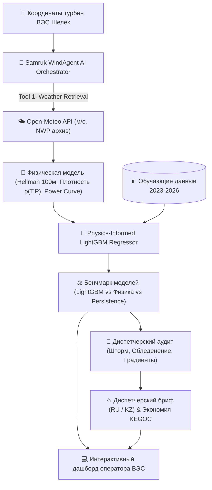

# ⚡ Samruk WindAgent AI — Agentic AI для прогнозирования выработки ВЭС

> **Кейс:** АО «Самрук-Қазына» (Самрук-Энерго / Qazaq Green Power)  
> **Трек:** Энергетика (Energy) | HackAlem AI 2026  
> **Команда:** Anhalt Students  
> **Репозиторий:** `BAITC-Hacks/hack-98e048a9-anhalt-students`  
> **Локация объекта:** Шелекский ветровой коридор (Алматинская/Жетысуская обл., Казахстан)  
> • Турбина №1: [`43.645150, 78.535604`](https://maps.app.goo.gl/iN6svMt69D5qRpFU9) — 2.5 МВт  
> • Турбина №2: [`43.643198, 78.538828`](https://maps.app.goo.gl/8UQMwsYavY6nLvFY8) — 2.5 МВт  
> • Суммарная мощность парка (кластер): 5.0 МВт  

---

## 📌 1. Ценность решения (25 баллов критерия Самрук-Казына)

### Проблема отрасли:
Резкая стохастическая изменчивость ветровых потоков в Шелекском коридоре приводит к ошибкам суточного планирования. В реалиях энергетического рынка Казахстана это влечет:
1. **Многомиллионные штрафы** от Системного оператора ЕЭС Казахстана (**АО «KEGOC»**) за положительные и отрицательные сальдо-небалансы мощности (расчётный тариф ~14 500 ₸/МВт·ч).
2. Необходимость держать дорогостоящие маневренные резервы генерации.
3. Риски механических аварий при штормовых ветрах ($v \ge 25$ м/с) и зимнем обледенении лопастей при отрицательных температурах.

### Наше решение:
**«Samruk WindAgent AI»** — автономная агентная система мультимодельного прогнозирования и диспетчеризации:
* **Автономный сбор погодных данных:** Open-Meteo Historical Forecast API (NWP архив) с жесткой гарантией метрических единиц (м/с, не км/ч) и детерминированным резервным режимом для жюри при отсутствии интернета.
* **Физическая модель IEC 61400-12 & Аэродинамика:** Закон сдвига Хеллмана ($\alpha \approx 0.20$ до высоты ступицы 100 м), термодинамическая плотность воздуха $\rho(T, P) = P / (R \cdot T)$ (морозный воздух -15°C на 10–14% плотнее стандартного $1.225 \text{ кг/м}^3$, что существенно увеличивает кинетическую энергию ветра) и жесткий штормовой останов при $\ge 25$ м/с.
* **Physics-Informed LightGBM:** Гибридная модель градиентного бустинга, обучающаяся на нелинейных остатках аэродинамической кривой.
* **Мультимодельный бенчмарк:** Прямое сопоставление на дашборде трех моделей:
  1. *Physics-Informed LightGBM* (флагманский агент)
  2. *Физическая кривая IEC 61400-12* (baseline)
  3. *Persistence Baseline* (наивный прогноз сохранения уровня)  
  с расчетом индекса Skill Score: $1 - \frac{\text{MAE}_{\text{model}}}{\text{MAE}_{\text{persistence}}}$.
* **Диспетчерский аудит (LLM/Rule Reasoner):** Формирует структурированный журнал событий, оперативные рекомендации для дежурного инженера и двуязычные брифы (RU & KZ) с расчетом предотвращенных штрафов KEGOC.

---

## 🏗️ 2. Архитектура Agentic AI



---

## 💻 3. Используемые технологии

* **Backend & Agent Engine:** Python 3.11+, FastAPI, Uvicorn
* **Machine Learning & Physics:** LightGBM, Scikit-learn, NumPy, Pandas
* **Weather Tool:** Open-Meteo Historical Forecast API (без обязательных платных ключей)
* **Frontend & Visualization:** Responsive HTML5/Tailwind CSS, Chart.js, Lucide Icons
* **Тестирование:** Pytest (100% pass)

---

## 🚀 4. Инструкция по установке и запуску (в 1 команду!)

> **Соответствие п. 5.4.15 и 5.6.5 регламента:** Проект воспроизводится и запускается локально без ручной настройки.

### Вариант 1 (Быстрый запуск через uv):
```bash
git clone https://github.com/BAITC-Hacks/hack-98e048a9-anhalt-students.git
cd hack-98e048a9-anhalt-students

# Запустить проект
uv run python backend/main.py
```

### Вариант 2 (Стандартный Python / pip):
```bash
pip install -r requirements.txt
python backend/main.py
```

После запуска откройте в браузере: **`http://localhost:8000`**

---

## 🧪 5. Порядок проверки решения экспертами и жюри

1. **Запуск веб-интерфейса:**
   * Откройте `http://localhost:8000`.
   * Выберите дату из тестового периода (`2026-02-14`), горизонт (`48 часов`) и объект: Турбина №1 (2.5 МВт), №2 (2.5 МВт) или вся ВЭС Шелек (5.0 МВт).
   * Нажмите **«Запустить Агента»**.
   * Отобразятся KPI выработки, три кривые прогноза (LightGBM, Физика, Persistence), Skill Score и оперативный бриф на RU / KZ.
2. **Экспорт прогноза в CSV для жюри:**
   * Нажмите кнопку **«Экспорт CSV»** (или вызовите `GET /api/export/csv?target_date=2026-02-14&horizon_hours=48&turbine_id=turbine_1`).
3. **Запуск симуляции за весь февраль 2026 (28 дней):**
   * Нажмите кнопку **«Симуляция 28 дней»** или вызовите `GET /api/simulation/february?turbine_id=farm`.
4. **Запуск автоматических тестов:**
   ```bash
   pytest tests/
   ```

---

## ⚙️ 6. Параметры окружения (.env)

> **Соответствие п. 5.6.6 регламента:** Проект работает в автономном режиме **без необходимости ввода личных платных API-ключей**. При отсутствии интернета агент автоматически задействует физико-метеорологический синтезатор.

```env
PORT=8000
HOST=0.0.0.0
DEMO_MOCK_MODE=false
```

---

## 📦 7. Раскрытие сторонних материалов (Open Source)

> В соответствии с **п. 5.4.4, 5.4.4.1 и 5.4.6 регламента**, декларируются все сторонние открытые компоненты:
* **[Open-Meteo API](https://open-meteo.com/)** (CC-BY 4.0) — метеорологические архивы и прогнозы.
* **[LightGBM](https://github.com/microsoft/LightGBM)** (MIT License) — градиентный бустинг деревьев решений.
* **[FastAPI](https://fastapi.tiangolo.com/)** (MIT License) — асинхронный фреймворк бэкенда.
* **[Tailwind CSS](https://tailwindcss.com/) & [Chart.js](https://www.chartjs.org/)** (MIT License) — компоненты пользовательского интерфейса.
* **[OpenAI Codex & Google Antigravity]** — парное проектирование и перекрёстный аудит кода во время хакатона.
