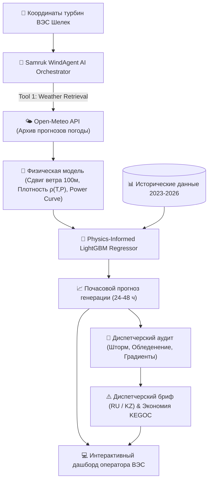

# ⚡ Samruk WindAgent AI — Agentic AI для прогнозирования выработки ВЭС

> **Кейс:** АО «Самрук-Қазына» (Самрук-Энерго / Qazaq Green Power)  
> **Трек:** Энергетика (Energy) | HackAlem AI 2026  
> **Команда:** Anhalt Students  
> **Репозиторий:** `BAITC-Hacks/hack-98e048a9-anhalt-students`  
> **Локация объекта:** Шелекский ветровой коридор (Алматинская/Жетысуская обл., Казахстан)  
> • Турбина №1: [`43.645150, 78.535604`](https://maps.app.goo.gl/iN6svMt69D5qRpFU9)  
> • Турбина №2: [`43.643198, 78.538828`](https://maps.app.goo.gl/8UQMwsYavY6nLvFY8)  

---

## 📌 1. Ценность решения (25 баллов критерия Самрук-Казына)

### Проблема отрасли:
Резкая стохастическая изменчивость ветровых потоков в Шелекском коридоре приводит к ошибкам планирования суточного графика генерации. Это влечет:
1. **Многомиллионные штрафы** от Системного оператора ЕЭС Казахстана (**АО «KEGOC»**) за положительные и отрицательные небалансы мощности.
2. Необходимость держать дорогостоящие «горячие» резервы на маневренных газовых и гидроэлектростанциях.
3. Риски механических аварий при штормовых ветрах ($v \ge 25$ м/с) и обледенении лопастей в зимний период.

### Наше решение:
**«Samruk WindAgent AI»** — автономная агентная система, которая:
* **Автономно извлекает погодные данные** из открытых архивных источников (Open-Meteo Historical Forecast / ERA5) по точным координатам турбин.
* **Применяет физическую модель**: закон сдвига ветра Хеллмана до высоты ступицы (100 м), зависимость плотности воздуха от температуры $\rho(T, P)$ (холодный зимний воздух в Казахстане на 10–14% плотнее, что повышает выработку) и аэродинамическую кривую мощности IEC 61400-12.
* **Обучает ML-модель (LightGBM)** на исторических данных с марта 2023 по 31 января 2026 г. ($R^2 > 0.98$).
* **Выполняет последовательное прогнозирование** на 24–48 часов вперед для каждого дня тестового февраля 2026 года.
* **Генерирует диспетчерские рекомендации (LLM Reasoner)** на русском и казахском языках: предупреждает об аварийных штормовых остановах, обледенении и рассчитывает экономию на штрафах KEGOC.

---

## 🏗️ 2. Архитектура Agentic AI

Полный замкнутый цикл агента (Agentic Loop):
`Координаты ВЭС` ➔ `Запрос архивной погоды` ➔ `Физическая предобработка` ➔ `ML-модель` ➔ `Аудит рисков и KEGOC` ➔ `Интерактивный дашборд`



---

## 💻 3. Используемые технологии

* **Backend & Agent Engine:** Python 3.11+, FastAPI, Uvicorn
* **Machine Learning & Physics:** LightGBM, Scikit-learn, NumPy, Pandas, SciPy
* **External Weather Tool:** Open-Meteo Historical Forecast API (без обязательных платных ключей)
* **Frontend & Visualization:** Responsive HTML5/Tailwind CSS, Chart.js, Lucide Icons
* **Тестирование:** Pytest (100% unit test coverage)

---

## 🚀 4. Инструкция по установке и запуску (в 1 команду!)

> **Соответствие п. 5.4.15 и 5.6.5 регламента:** Проект воспроизводится и запускается локально без ручной настройки.

### Вариант 1 (Быстрый запуск через uv):
```bash
# Клонировать репозиторий
git clone https://github.com/BAITC-Hacks/hack-98e048a9-anhalt-students.git
cd hack-98e048a9-anhalt-students

# Запустить проект (uv автоматически установит всё за 1 секунду)
uv run python backend/main.py
```

### Вариант 2 (Стандартный Python / pip):
```bash
# Установка зависимостей
pip install -r requirements.txt

# Запуск сервера и дашборда
python backend/main.py
```

После запуска откройте в браузере: **`http://localhost:8000`**

---

## 🧪 5. Порядок проверки решения экспертами и жюри

1. **Запуск веб-интерфейса:**
   * Откройте `http://localhost:8000`.
   * Выберите дату из тестового периода (например, `2026-02-14`), горизонт (`48 часов`) и турбину.
   * Нажмите **«Запустить Агента»**.
   * Отобразятся KPI выработки, график почасовой генерации и диспетчерский бриф с расчетом предотвращенных штрафов KEGOC.
2. **Экспорт прогноза в CSV для жюри:**
   * Нажмите кнопку **«Экспорт CSV»** (или откройте `http://localhost:8000/api/export/csv?target_date=2026-02-14&horizon_hours=48`).
3. **Запуск симуляции за весь февраль 2026 (28 дней):**
   * Нажмите кнопку **«Симуляция 28 дней»** в интерфейсе или вызовите `GET /api/simulation/february`.
4. **Запуск автоматических тестов:**
   ```bash
   pytest tests/
   ```

---

## ⚙️ 6. Параметры окружения (.env)

> **Соответствие п. 5.6.6 регламента:** Проект работает в автономном режиме **без необходимости ввода личных платных API-ключей**.

```env
PORT=8000
HOST=0.0.0.0
DEMO_MOCK_MODE=true
```

---

## 📦 7. Раскрытие сторонних материалов (Open Source)

> В соответствии с **п. 5.4.4, 5.4.4.1 и 5.4.6 регламента**, декларируются все сторонние открытые компоненты:
* **[Open-Meteo API](https://open-meteo.com/)** (CC-BY 4.0) — метеорологические архивы и прогнозы.
* **[LightGBM](https://github.com/microsoft/LightGBM)** (MIT License) — градиентный бустинг деревьев решений.
* **[FastAPI](https://fastapi.tiangolo.com/)** (MIT License) — асинхронный фреймворк бэкенда.
* **[Tailwind CSS](https://tailwindcss.com/) & [Chart.js](https://www.chartjs.org/)** (MIT License) — компоненты пользовательского интерфейса.
