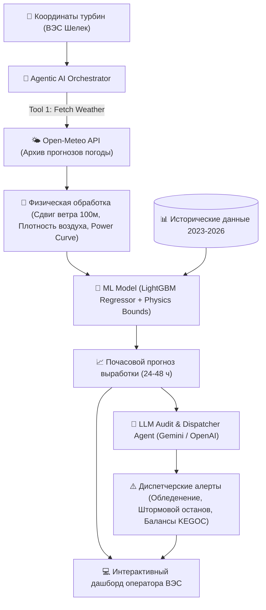

# ⚡ SPECIFICATION: Agentic AI для прогнозирования выработки ВЭС
> **Партнёр:** АО «Самрук-Қазына» / Самрук-Энерго  
> **Трек:** Энергетика (Energy) | HackAlem AI 2026  
> **Команда:** Anhalt Students  

---

## 1. Постановка проблемы и ценность решения

### Проблема:
Ветроэнергетика Казахстана (в частности Шелекский ветровой коридор в Алматинской/Жетысуской области) характеризуется высокой изменчивостью ветровых потоков. Неточное суточное планирование выработки ВЭС приводит к:
1. Штрафам со стороны системного оператора (АО «KEGOC») за небалансы мощности.
2. Неэффективному диспетчерскому управлению резервами маневренной генерации.
3. Потерям выручки ветропарка при аварийных сбросах мощности (curtailment).

### Решение:
**«Samruk WindAgent AI»** — автономная мультиагентная система прогнозирования почасовой выработки ВЭС на горизонте 24–48 часов.
Система реализует замкнутый автономный цикл (Agentic Loop):
- **Сбор:** По координатам ветротурбин агент автоматически извлекает архивные погодные прогнозы из открытых источников (Open-Meteo Historical Forecast / ERA5 / GFS).
- **Физическая нормализация:** Учитывается степенной закон сдвига ветра (Hellman wind shear) до высоты ступицы турбины (100 м), плотность воздуха $\rho(T, P)$ и аэродинамическая кривая мощности (Power Curve: cut-in 3 м/с, rated 12 м/с, cut-out 25 м/с).
- **ML-прогнозирование:** Обученная модель (LightGBM / Physics-Informed ML) генерирует почасовой прогноз активной мощности $P_{norm} \in [0, 1]$ на 24–48 часов.
- **Агентный анализ и объяснимость (LLM Reasoner):** Агент инспектирует прогноз, находит аномалии (штормовой ветер > 25 м/с, риск обледенения лопастей при $T < 0^\circ\text{C}$, резкие провалы генерации) и формулирует рекомендации диспетчеру на русском и казахском языках.
- **Итеративное обновление:** Агент воспроизводит последовательный прогноз день за днем на весь тестовый период (1–28 февраля 2026 г.).

---

## 2. Исходные данные и координаты

* **Турбина 1:** `43.645150, 78.535604` (Шелек, Алматинская обл.)
* **Турбина 2:** `43.643198, 78.538828`
* **Обучающая выборка:** март 2023 — 31 января 2026 г. (статистическое время, скорость ветра м/с, нормализованная мощность, температура окружающей среды).
* **Тестовый период:** 1 февраля 2026 — 28 февраля 2026 г.
* **Источник погоды:** Open-Meteo Historical Archive / Forecast API (координаты, высота 100м, температура, направление и порывы ветра).

---

## 3. Архитектура Agentic AI

---

## 4. Критерии оценки Самрук-Казына (100 баллов)
1. **Соответствие задаче и работоспособность (25 б.)**: Точный прогноз на 24-48 ч для февраля 2026 с почасовой детализацией.
2. **Техническая реализация (25 б.)**: Полный Agentic-цикл (погода -> предобработка -> ML -> анализ -> пересчет).
3. **README и воспроизводимость (25 б.)**: Запуск в одну команду, понятные инструкции, тесты.
4. **Ценность и применимость (15 б.)**: Экономия на штрафах KEGOC, интеграция в диспетчерский контур.
5. **Потенциал развития и оригинальность (10 б.)**: Физическая модель сдвига ветра на 100м, мультиязычные алерты, интеграция LLM-судьи.
